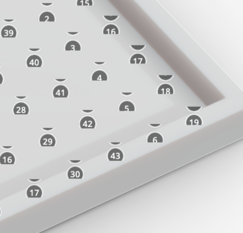
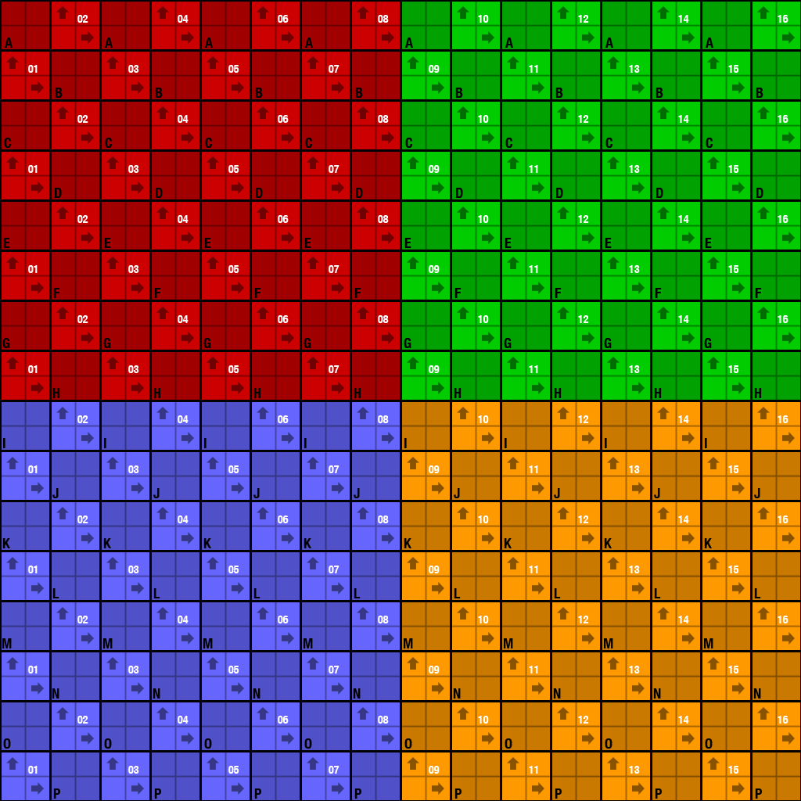
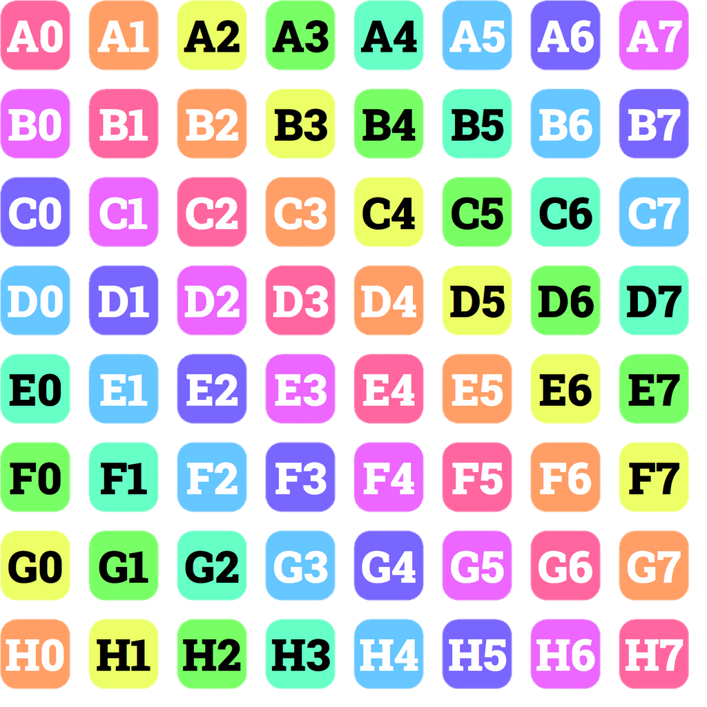

<script setup>
import CodePenEmbed from '../../components/CodePenEmbed.vue'
</script>

# Annotation Texture

It's possible to change the appearance of the little circle that represents an annotation. This is done with the `setAnnotationsTexture` method. An example of this can be seen in the [Product Tour](../../projects/product-tour.md) project. The annotations in that project are blue circles.

Sketchfab has created a few examples to demonstrate this [here](https://sketchfab.com/developers/viewer/examples?sample=Custom%20Annotation). These examples look like hocus pocus to me, but they show two very interesting things. The texture is an image, but instead of using an image file they use a data URL and they generate an SVG on the fly. Both are quite useful, but let's start with an image from file first.

```js
api.setAnnotationsTexture(
  {
    url: "https://example.com/your-image.png",
    colNumber: 4,
    padding: 2,
    iconSize: 32,
  },
  function (err) {
    if (!err) {
      window.console.log("Updated annotation texture.");
    }
  },
);
```

You provide a URL to the image (which can be the URL to a file or a data URL). The `colNumber` is the number of columns in the image. The `padding` is the space between the icons. The `iconSize` is the size of the icons in the image.

## Padding and iconsize

You can use a single image as annotation texture. For instance, a logo. But you can also use a spritesheet. A spritesheet is a single image that contains multiple cells. The `padding` and `iconSize` properties are used to determine the size of the individual cells in the spritesheet.


_Spritesheet by [smellykittylitter](https://www.deviantart.com/smellykittylitter/art/RPG-Maker-MV-Link-Spritesheet-653129518)_

::: tip
When you don't use padding (`padding: 0`), the `iconSize` should be 2 pixels smaller than the actual file. So, if your logo file is 64 pixels wide and high, the `iconSize` should be 62 :shrug:
:::

The padding is assumed to be on the right and bottom of each cell in a spritesheet. The padding is not assumed to be on the left and top. This means that the first cell in the spritesheet should be at the top left of the image. When you use padding between the cells, the sum of the padding and the iconSize should be equal to one entire cell.

## Default annotation issue

Let's start with an issue of the default annotations. If you create many annotations, the default annotation texture will misalign.



<CodePenEmbed id="LYaJBMv" tab="result" />

This example shows the creation of 256 annotations in a grid. Starting from the top left, you'll see the misalignment start at about annotation 50. And as you can see, the default annotations only go until 50. After that, the default texture is repeated. It's likely the padding in the texture is added to the top too.

## Image texture examples

Let's first use a single annotation texture. This is useful when you want to use a company logo as annotation for instance. The image is a simple PNG file.

<CodePenEmbed id="abMaRqJ" tab="result" />

You'll notice in the codepen that I'm using a `Promise`. We need to wait until all annotations have been created before the texture can be changed. The `Promise` will help with that.

::: warning
If you use a texture with and a texture without padding and you switch between them, the non-padded texture will be misaligned. This appears to be a bug in Sketchfab.
:::

### Single image


```js
{
  url: "https://assets.codepen.io/2407400/Klaas_profilePicture_128.png",
  colNumber: 0,
  padding: 0,
  iconSize: 126
}
```

### Grid image

{width=360px height=360px}

```js
{
  url: "https://assets.codepen.io/2407400/uvgrid1024-colour.png",
  colNumber: 16,
  padding: 0,
  iconSize: 62
}
```

### Grid image with padding

{width=360px height=360px}

```js
{
  url: "https://assets.codepen.io/2407400/annotations-grid-padded-3.png",
  colNumber: 8,
  padding: 26,
  iconSize: 102
}
```

## SVG Texture

The advantage of an SVG texture is that we can create it on the fly. This is useful when you want to take user input and use that in the annotations.

<CodePenEmbed id="qBvMGXm" tab="result" />

In this example we create an an SVG texture when the user types in text. Each hotspot gets a single character of the text. Optionally, you can make the background of the hotspot white or a random color. The great thing here is that the SVG texture is created almost instantly. It responds really well to user input.
