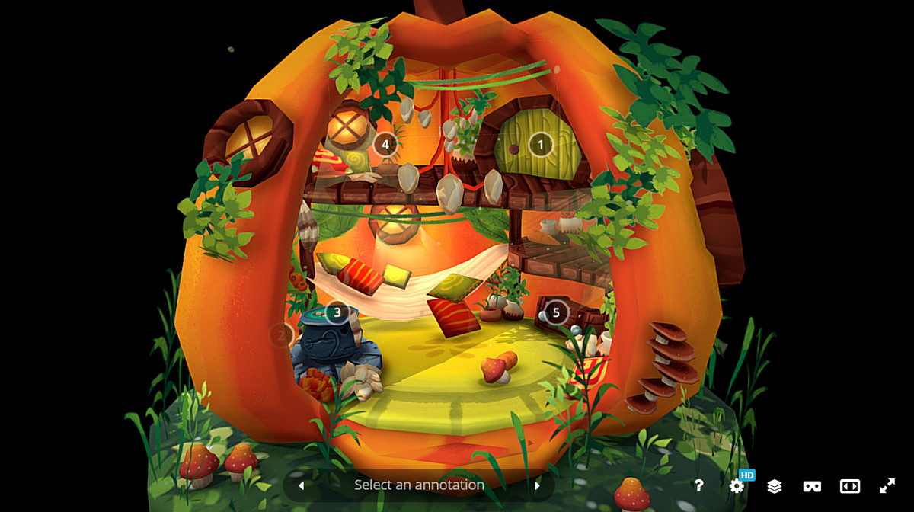
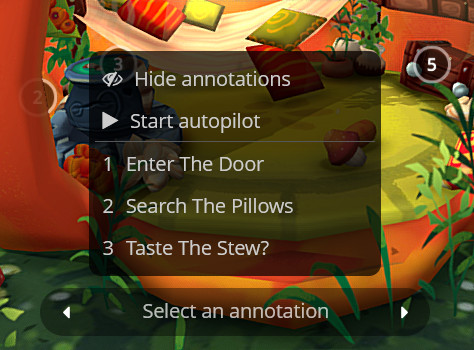
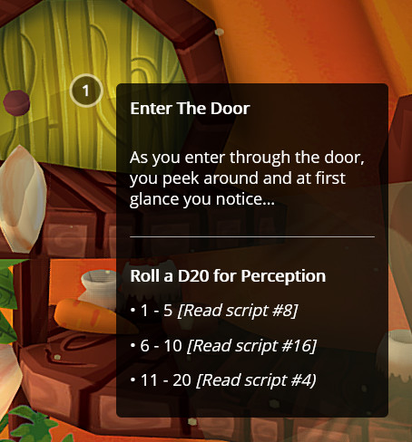

# Overview

Annotations are a great way to add interactivity to your 3D models. They can be used to highlight parts of your model, add information, or create a guided tour. Noramlly you'd use the editor to add and manage your annotations. But there are many usecases where you'd want to add and manipulate annotations with the API. For example, you could use the API to add annotations to your model based on data from an external source. Or you can create a multilingual experience. The Sketchfab API enables you to add, remove, and manipulate annotations in your 3D models.

## Anatomy of annotations

The annotation system consists of three parts:

1. **Hotspots** are the floating dots that you see in the viewer. They are positioned in 3D space and stick with that position when you navigate the model.
2. **Annotations** are the notes that appear when you click on a hotspot. They are positioned next to the hotspot and disappear when you navigate the model.
3. **Annotation Menu** is the menu that you see at the bottom of the iframe. You can use this menu to navigate between annotations.

*This is the annotation menu*

*This is a hotspot with its expanded annotation*

We can use the API to edit the appearance and behavior of each of the three parts of the annotation system. We can also use the API to create new annotations from scratch and edit the contents of existing annotations.
