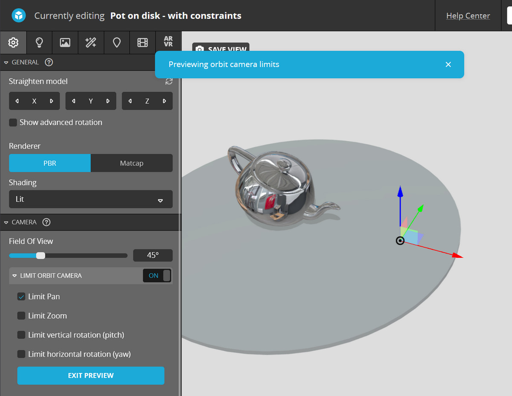
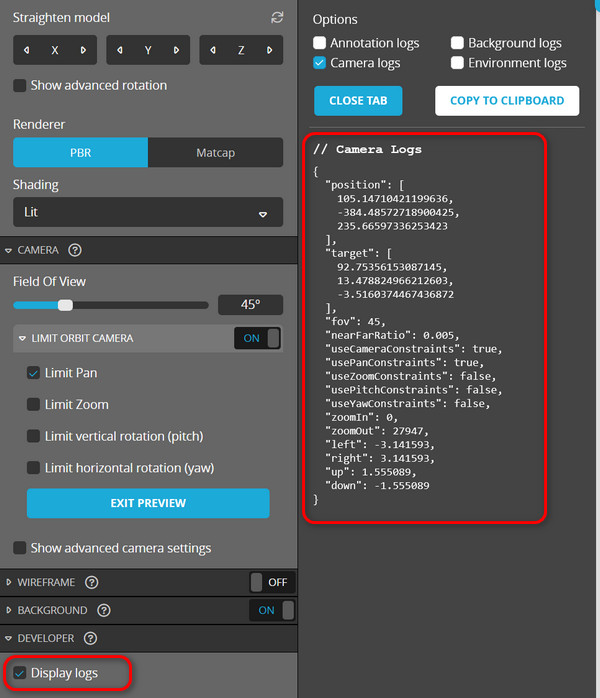

<script setup>
import ModelLoading from '../../components/ModelLoading.vue'
import CodePenEmbed from '../../components/CodePenEmbed.vue'
</script>

# Camera constraints

Camera constraints are used to limit the camera's movement in the scene. They are useful to closely control how a user experiences a model. You can set zoom limits if you don't want people zooming in too close, limit rotation to avoid viewing the underside of a model or locking camera panning. You can set up these constraints in the Editor, but you can also do it with the API.



In this example, the "Pan limit" has been activated. This means the target of the camera is locked to a fixed position. The user can still rotate the camera around the target, but can't move the target.

<ModelLoading id="7b6c7c87d3a84c72991e37b7a732489d" :playersettings="{autostart:1}" />

## Setting constraints with the API

Let's try set similar constraints with the API. We start with an unconstrainted scene. 

We'll use this to set up the constraints to limit pan.:

```js
const settings = {
  usePanConstraints: true,
  target: [92, 13, 10]
};
api.setCameraConstraints(settings)
```

To keep things consistent, we use the `setEnableCameraConstraints` method to enable or disable the constraints. Combine them like this:
  
```js
api.setCameraConstraints(settings, function (err) {
  api.setEnableCameraConstraints(true, {});
});
```

First you apply the settings for the constraints, and then you turn them on. It's possible to change the order, skip using the callback or use a different combination. But in my experience this is the most reliable way to set constraints.

<CodePenEmbed id="bGOVjYL/433631197fa5bc0d73d31745730431ea" tab="result" />

## Camera conflicts

There are situations where you want to limit the pan, but still make it possible to move the camera. Imagine building a configurator of a bicycle. You want to limit panning to avoid the users moving away from the product. But you also want to offer closeups of the saddle and steering wheel. You need several different constraints for this.

<CodePenEmbed id="NWeGBJL/4a4a610cccfdbfeb5eb747745a1fb659" tab="result" />

The camera movement in this example is rather complex. We want to move the camera, but also have constraints. But if we move the camera with the API and it hits one of the constraints (for example a zoom constraint) the camera stops moving. To work around this we will do the following when we want to move the camera:

1. Disable the constraints
2. Move the camera
3. Wait until the camera has stopped moving
4. Update the constraint settings
5. Enable the constraints

Because Sketchfab works with callbacks, we can't just write this in a linear way. We need to nest the callbacks. This is called a callback hell. It's not pretty.

```js
api.setEnableCameraConstraints(false, {}, function (err) {
  api.setCameraLookAt(position, target, 2, function (err) {
    api.setCameraLookAtEndAnimationCallback(function (err) {
      api.setCameraConstraints(constraints, function (err) {
        api.setEnableCameraConstraints(true, {});
      });
    });
  });
});
```

## Other constraints

You can find out what all the available constraints are in the Editor. You can enable the developer logs and get the code of the current constraints.



```js
{
  "position": [
    105.14710421199636,
    -384.48572718900425,
    235.66597336253423
  ],
  "target": [
    92.75356153087145,
    7.695073773650684,
    50.21317829159777
  ],
  "fov": 45,
  "nearFarRatio": 0.005,
  "useCameraConstraints": true,
  "usePanConstraints": false,
  "useZoomConstraints": false,
  "usePitchConstraints": false,
  "useYawConstraints": false,
  "zoomIn": 0,
  "zoomOut": 27947,
  "left": -3.141593,
  "right": 3.141593,
  "up": 1.555089,
  "down": -1.555089
}
```