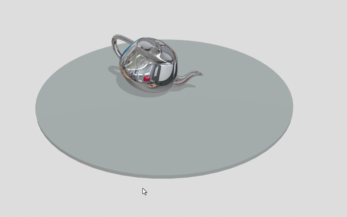
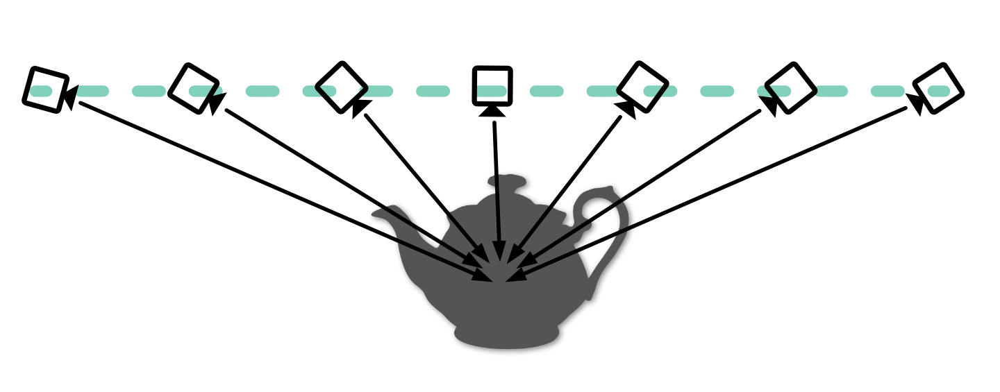
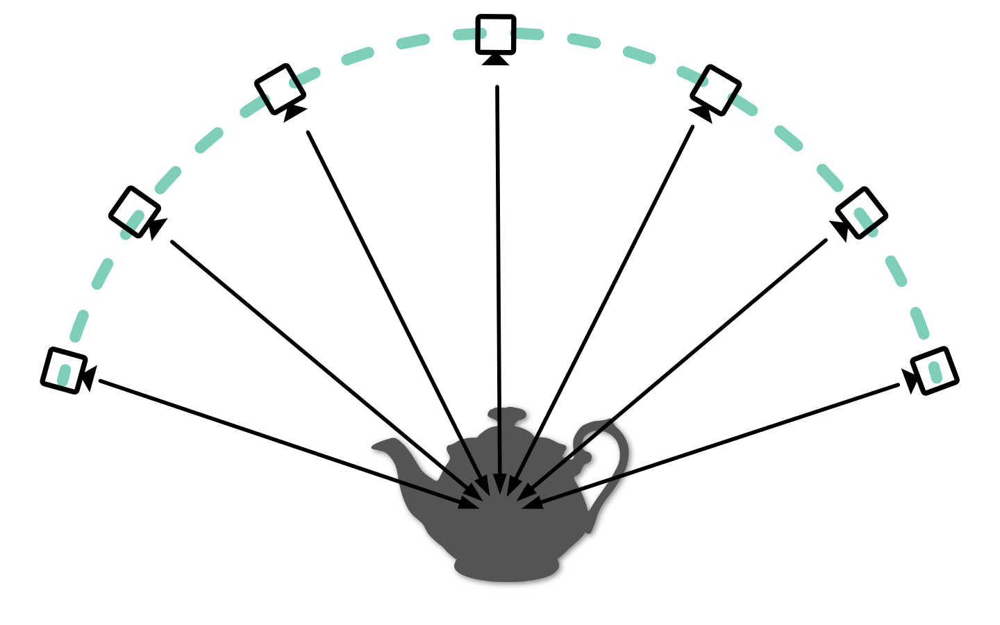

<script setup>
import CodePenEmbed from '../../components/CodePenEmbed.vue'
</script>

# Orbiting the camera

When you navigate around a 3D model in Sketchfab, you generally orbit the camera. When you click and drag, the target of the camera stays in place and the camera moves around it, keeping the same distance to the target. This is a great way to view 3D objects and feels very natural.



_Manually orbiting the camera_

When you use the API to move the camera from A to B however, the camera moves in a straight line. This results in an unnatural experience. In this chapter we'll learn how to orbit the camera with the API and why it's a good thing.

## Linear movement

We're not going to bother with camera constraints in this tutorial. If you want, you can read up on constraints [here](./camera-constraints.md).

<CodePenEmbed id="KKJJpOv/4b41f7771cb1037c19b80580da54231d" tab="result" />

When you press the "Left" and "Right" buttons, the camera moves from one side of the teapot to the other side. The camera target stays at the origin. When the camera moves towards the teapot, it keeps looking at the target. When the camera passes the teapot, it turns really quickly to keep looking at the target. The quick turn is very disorienting.



_Linear camera movement with the API_

We can avoid the quick turn by keeping more distance between the camera and target. But sometimes, the target just needs to be where the object is. In that case, we need to orbit the camera.

## Orbital movement

Orbiting the camera means that it moves around the target while keeping its distance. We can compare this kind of movement to traveling across the globe. When you fly from Tokyo to New York, you don't fly in a straight line through the earth. You follow the curve of the earth.



_Orbital camera movement_

Let's assume our target is at the center of the earth and I want to move my camera from Tokyo to New York while looking at that target. The Sketchfab API gives us the positions of the camera and target with the `getCameraLookAt` method. This returns points in space with an x, y and z coordinate. But what I need to move the camera along the surface of the earth is a latitude and longitude. This requires some math. [Movable Type](https://www.movable-type.co.uk/scripts/latlong-vectors.html) has a great explanation on how to do this.

First of all, we need to convert the x, y and z coordinates to a latitude and longitude. We can do this with the `toLatLon` method. Then we need to get the distance between the camera and target. I use the `getDistance` method for this. We do both calculations for the start- and the endposition (Tokyo and New York). Then we interpolate the latitude and longitude between the start- and endposition. We must do this interpolation ourselves, instead of having the Sketchfab API calculate the inbetween positions for us.

Sketchfab does not understand lat/lon. While interpolating the inbetween positions, we must convert the lat/lon back to x/y/z coordinates. We can do this with the `toPosition` method. Finally, we can move the camera to the new position with the `setCameraLookAt` method.

```js
toLatLon(x, y, z) {
  const lat = Math.atan2(z, Math.sqrt(x*x + y*y));
  const lon = Math.atan2(y, x);

  return [lat, lon];
}

getDistance(x1, y1, z1, x2, y2, z2) {
  const dx = x2 - x1;
  const dy = y2 - y1;
  const dz = z2 - z1;

  return Math.sqrt(dx*dx + dy*dy + dz*dz);
}

toPosition(lat, lon, distance) {
  const sinLat = Math.sin(lat);
  const cosLat = Math.cos(lat);
  const sinLon = Math.sin(lon);
  const cosLon = Math.cos(lon);

  const x = cosLat * cosLon;
  const y = cosLat * sinLon;
  const z = sinLat;

  return [x * distance, y * distance, z * distance]
}
```

<CodePenEmbed id="YzBBGRa/928fedc4f6cabcc028afd8df1c1ec774" tab="result" />

This example shows how to move the camera from your current location to another location. The camera moves in an orbital fashion. The general process is as follows:

- get the current camera position and target
- calculate the distance between the camera and target and get the latitude and longitude
- do the same for the destination position
- calculate the difference between the start- and endposition's latitude and longitude, target and distance
- interpolate the latitude and longitude between the start- and endposition

## Interpolation

We're using the `requestAnimationFrame` method to animate the camera. This method calls a function every time the browser is ready to draw a new frame. This is a great way to animate things in the browser. You can read more about it [here](https://developer.mozilla.org/en-US/docs/Web/API/window/requestAnimationFrame). Alternatively, you can use `setInterval` or the [GSAP](https://greensock.com/gsap/) library to animate things.

Initially, we interpolate the camera in 50 steps. But what if the distance between the start- and endposition is very large? Then we might need more steps to make the animation smooth. We can calculate the distance between the start- and endposition and use that to determine the number of steps. We can use the `getDistance` method for this.

```js
const distance = getDistance(camTo.position, camFrom.position);
const steps = Math.floor(distance / 12);
```

`distance/12` is just a hardcoded value to get to a good number of steps. You can adjust this if you like longer or shorter durations.

<CodePenEmbed id="qBggZMJ/4b7c86643a129af7a566ac43b723890a" tab="result" />

## Moving target

In the previous examples, we assumed the destination target was at the origin `[0, 0, 0]`. But of course this is not always the case. We need to take into account the offset a target might have. The target is relevant when calculating the latitude and longitude and when calculating the final position of the camera.

Instead of calculating the angles relative to the origin `[0, 0, 0]`, we calculate them relative to the target.

```js
const toLatLon = (position, target) => {
  const vector = subtractPositions(target, position);
  const lat = Math.atan2(
    vector[2],
    Math.sqrt(vector[0] * vector[0] + vector[1] * vector[1]),
  );
  const lon = Math.atan2(vector[1], vector[0]);
  return [lat, lon];
};
```

<CodePenEmbed id="xxMMEmd/be14420df58405c66852d0405f618f8e" tab="result" />

## Easing

The Sketchfab API uses easing to make camera movement smooth. You probably have noticed our camera movement is quite sudden. We can apply easing ourselves to solve this. The site [Easings.net](https://easings.net/#) provides a great overview of different easing functions with code ready-to-go. We can use these functions to calculate the inbetween positions.

Instead of interpolating the new position in a linear fashion, easing will modify the speed at which the camera moves. For instance `easeInOutQuad` will start slow, then speed up and then slow down again. This is a much more natural movement and resembles how Sketchfab moves cameras.

```js
function easeInOutQuad(x) {
  return x < 0.5 ? 2 * x * x : 1 - Math.pow(-2 * x + 2, 2) / 2;
}
const factor = (factor = easeInOutQuad(step / steps));
```

<CodePenEmbed id="eYxxBmB/4f141b30749a2eb02c52d0857a2997d0" tab="result" />
