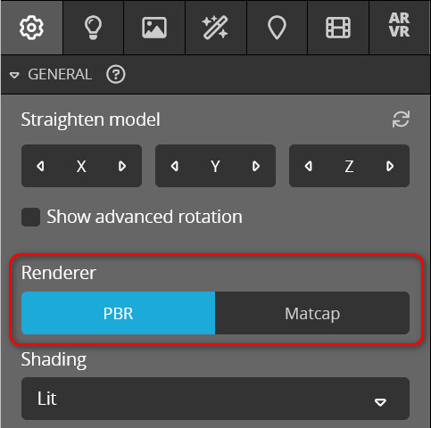
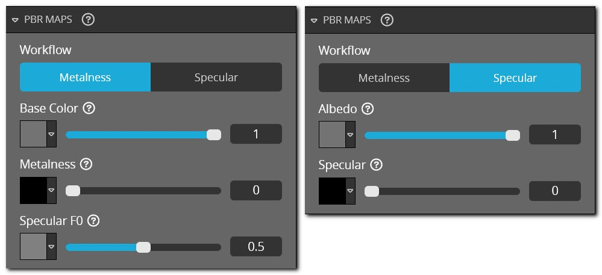

<script setup>
import ModelLoading from '../../components/ModelLoading.vue'
import CodePenEmbed from '../../components/CodePenEmbed.vue'
</script>

# Material channels

The actual properties of a material are stored in channels. These channels are the same as the channels you see in the Sketchfab editor. Each channel has its own properties, such as: color, texture, value, enabled, etc.

The Sketchfab editor has all the channels neatly organized and tends to hide or disable settings when you don't use them. When using the Sketchfab API, you have to deal with all the channels, even the ones you don't use. This can be a bit overwhelming at first.

## Shader

Sketchfab uses two renderers: PBR and Matcap. The PBR renderer is used for most models. The PBR renderer supports two so-called workflows: Metalness and Specular. Each of these two workflows share a bunch of channels, but also have their own unique channels.



*You can toggle between PBR and Matcap in the Sketchfab editor.*



*You can switch between Metalness and Specular in the Sketchfab editor.*

All channels for both renderers and both workflows are listed in the [Sketchfab docs](https://sketchfab.com/developers/viewer/functions#api-materialChannels). Before going deeper into the channels, please note the following:

- a metalness shader uses `Base Color` in the Sketchfab editor, but `AlbedoPBR` in the API
- a specular shader uses `Albedo` in the Sketchfab editor, but `DiffusePBR` in the API
- some channels end with `PBR` in their name, others don't. This doesn't have any particular meaning
- there are still channels that belong to the deprecated Classic shader. These channels don't have any effect, other than to confuse

Yes, this is rather odd and will take some time getting used to.

While you can switch between the metalness and specular shader with the API, I don't recommend doing so. It's really easy to forget to change all the channels. It's better to stick to one shader and use the appropriate channels.

## Channel settings

Each channel has its own properties. You can find out which properties are available by looking at the list of materials. Common properties are:

```js
{
  AlbedoPBR: {
    color: [0.17, 0.35, 1],
    enable: true,
    factor: 1
  },
  MetalnessPBR: {
    enable: true,
    factor: 0.68
  },
  RoughnessPBR: {
    enable: true,
    factor: 0.85,
    texture: {..}
  },
  NormalMap: {
    enable: true
    factor: 0.5,
    flipY: false,
    texture: {..}
  }
}
```

Each channel has an `enable` property. By enabling and disabling the appropriate channels you can switch between metalness and specular workflows and toggle between the roughness and glossiness channel. You'll also notice that the `AlbedoPBR.color` property is an array of three normalized values for RGB. Some channels have an optional `texture` property. Read more about textures [here](./textures). But usually textures and colors are mutually exclusive. If you want a texture on the `AlbedoPBR` channel, you'll have to remove the `color` property.

## Changing channels

Once you know your way around the channels, changing them is quite easy. Let's look at an example:

<CodePenEmbed id="XWyLmGy/d5d6db0b05e32e9092388195d53c174d" />

The first step is to get the list of materials, and finding one material in particular by its name: 

```js
api.getMaterialList(function (err, materials) {
  const theMaterial = materials.find((item) => item.name === "Disk");
});
```

Next, we change a channel property in the material. In this example we change one property, but you can change as many properties at once as you like:

```js
theMaterial.channels.AlbedoPBR.color = [0.17, 0.35, 1];
```

Finally, we send the full material back to Sketchfab:

```js
api.setMaterial(theMaterial, function (err) {
});
```

## Replacing channels

Here is an alternative approach to changing channels. Instead of changing a property in a channel, we replace the entire channels object of the material. The result is the same, Sketchfab will update the material with the new channels and keep all channels that weren't replaced:

<CodePenEmbed id="YzRgdyr/d223d5c1688af5888aefd2aedcec8d66" />

Only the second step is different:

```js
theMaterial.channels = {
  AlbedoPBR: { color: [1, 0, 0.3] }
};
```

## Metallic PBR Channels

Of the entire list of channels, the following are specific to the metallic PBR workflow:

- AlbedoPBR
- MetalnessPBR
- SpecularF0

<ModelLoading id="c2fb3b0dbd4c4071bf9b4656ed41a432" :showMaterials="true" :playersettings="{autostart:0}" />

## Specular PBR Channels

Of the entire list of channels, the following are specific to the specular PBR workflow:

- DiffusePBR
- SpecularPBR

<ModelLoading id="b10ecfe761fe425ba40b01f7096a43ff" :showMaterials="true" :playersettings="{autostart:0}" />

