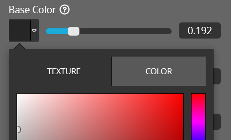

<script setup>
import ModelLoading from '../../components/ModelLoading.vue'
import CodePenEmbed from '../../components/CodePenEmbed.vue'
</script>

# Textures

Most material channels will accept a texture as input. The texture can be a file uploaded to Sketchfab, a texture from the model's original file, a file from a server or a file from disc. In this section we'll look at how to use textures in your materials.

## Texture list

First, we should get a list of the textures available in the model. You can do this with the `getTextureList` method:

```js
api.getTextureList(function (err, texturelist) {
  console.log(texturelist);
});
```

<CodePenEmbed id="QWJXypx/e12f2cb90ff0ebe6d8e83e503b2d8250" />

The list of textures contains the information of the textures that are available in the Sketchfab scene. We will use the **name** and **uid** later to refer to the texture. Only textures that are used in a material are available to the API. If you have uploaded textures in the Sketchfab editor, but you haven't applied them to channels in materials, you won't see them in the list.

An example of a single texture:

```js{2,3}
{
  name: "uvgrid1024-colour.png",
  uid: "1d37ac1c53a34f74b74504a53043f278",
  colorSpace: "unknown",
  createdAt: "2023-08-10T20:59:05.893014",
  images: [],
  updatedAt: "2023-08-10T20:59:09.283886",
}
```

## Textures in materials

Textures also show up in the materials. Here is a list of the two materials in the scene. Each material contains a texture.

<ModelLoading id="3e1a54cc0bb849f4a553b98ea401b7b4" :showMaterials="true" :playersettings="{autostart:1}" />

```js
"AlbedoPBR": {
  "enable": true,
  "factor": 1,
  "UVTransforms": {
    "scale": [ 1, 1 ],
    "offset": [ 0, 0 ],
    "rotation": 0
  },
  "texture": {
    "magFilter": "LINEAR",
    "minFilter": "LINEAR_MIPMAP_LINEAR",
    "wrapS": "REPEAT",
    "wrapT": "REPEAT",
    "textureTarget": "TEXTURE_2D",
    "internalFormat": "RGB",
    "texCoordUnit": 0,
    "uid": "1d37ac1c53a34f74b74504a53043f278"
  }
}
```

This is the AlbedoPBR channel of the teapot material. You see there's no more `color` property, like we saw in the [Material Channels](./channels) topic. Instead, there's a `texture` property. For almost all channels, color and texture are mutually exclusive. Read more about that here: [Texture and color](#texture-and-color)

The texture property contains the uid of the texture we found in the texture list. This is how the API knows which texture to use in the material. We'll ignore all texture properties except uid for now. There's also a UVTransforms property. This is used to transform the texture coordinates. We'll look at this later.

## Changing textures

Now that we know how to get the list of textures and how to find them in the materials, let's look at how to change them. This example shows how you can change textures that are already on the Sketchfab scene. If there already is a texture object in the material channel, changing the `uid` of the texture is all you need.

<CodePenEmbed id="OJaeMvQ/c2377cf0b264ae0d16ea0af344ae1b08" />

Here is the critical part of the code:

```js:line-numbers
api.getTextureList(function (err, texturelist) {
  const dotsTexture = texturelist.find((item) => item.name === "dots.png");
  potMaterial.channels.AlbedoPBR.texture.uid = dotsTexture.uid;
  api.setMaterial(potMaterial);
});
```

1. Get the list of textures with `api.getTextureList`
2. Find a texture in the list by name with `Array.find`
3. Set the uid of the texture in the material
4. Set the material with `api.setMaterial`. This last step sends all your edits back to Sketchfab

## Loading new textures

You can load new textures into the scene. This is useful when you have many texture variations and don't want to load all of them in the Sketchfab model. Loading textures on demand can save bandwidth and improve performance.

<CodePenEmbed id="zYMVrev/35d222c624f6acff91a2689a622c5501" />

This is the critical part of the code:

```js:line-numbers
api.addTexture(textureUrl, (err, uid) => {
  diskMaterial.channels.AlbedoPBR.texture = { uid: uid };
  api.setMaterial(diskMaterial, function () {});
});
```

1. Use `api.addTexture` to load a texture from a URL
2. Create a new texture object with the uid of the texture
3. Set the material with `api.setMaterial`

You see that the new texture object that we create is very minimal. It only contains the uid. We can ignore all other properties that we saw earlier until we cover them in a new lesson.

## Reusing textures

In the previous example, we load a new texture every time you press one of the buttons. This is not good for performance, especially if we work with large textures. It's better to load the texture once and reuse it. You can do this by storing the uid of the texture in a variable and reusing it.

<CodePenEmbed id="qBQzRbM/ff342f92923c7b248d370ac5d882e923" />

In this example there's a large image of a market. It's about 4MB. You'll notice that the first time you load the market image, it takes a while to load. But if you press the button again, it loads instantly. This is because the texture is already loaded and cached. The second time we are just reusing the texture uid.

Here's the interesting bit of code: 

```js
const marketSrc = {
  url: "https://assets.codepen.io/2407400/market-large.jpg",
  uid: undefined
};

const loadTexture = (api, textureData) => {
  if (textureData.uid === undefined) {
    api.addTexture(textureData.url, (err, uid) => {
      textureData.uid = uid;
      diskMaterial.channels.AlbedoPBR.texture = { uid: uid };
      api.setMaterial(diskMaterial, function () {});
    });
  } else {
    diskMaterial.channels.AlbedoPBR.texture = { uid: textureData.uid };
    api.setMaterial(diskMaterial, function () {});
  }
};
```

The source of the texture is now stored in an object with a `url` and a `uid`. The uid is unknown at the start. When we first run the `loadTexture` function, it uploads the texture, stores the uid in our object with `textureData.uid = uid` and then updates the material. The next time we run the `loadTexture` function, we reuse our previously stored uid.

## Texture and color

Some materials offer the choice of either using a color or a texture. In the Sketchfab editor you've got a clear toggle between color and texture. But in the API, there's no such thing. How do we tell the API to use a color or a texture?



*Toggle between color and texture*

With the API, if you want to use a color, you should remove the `texture` from the materialchannel. If you want to use a texture, you can actually keep the color; it's ignored. But I feel it's cleaner to remove the `color` from the materialchannel.

This `AlbedoPBR` uses a texture:

```js
AlbedoPBR: {
  "enable": true,
  "factor": 1,
  "texture": { "uid": "fc3c1c3f0354456bbcd8723598ba37fa"}
}
```

This `AlbedoPBR` uses a color:

```js
AlbedoPBR: {
  "enable": true,
  "factor": 1,
  "color": [ 0.1, 0.3, 1 ]
}
```

<CodePenEmbed id="LYXKxQa/070d077a2dcb24c7e740b3e3b6835e0d" />

## CORS

When you start loading new textures, you'll eventually run into CORS issues. It's an abbreviation for Cross-Origin Resource Sharing, a security feature that prevents websites from loading resources from other websites. You can read more about it on [MDN](https://developer.mozilla.org/en-US/docs/Web/HTTP/CORS) and on [enable-cors.org](https://enable-cors.org/).

The `api.addTexture` method requires the texture to be cors-enabled. This basically means that you're telling Sketchfab it's ok to load that texture from another server. This is easiest to do if you control the server where the texture is hosted.

::: info Documentation
[getTextureList](https://sketchfab.com/developers/viewer/functions#api-getTextureList)

[addTexture](https://sketchfab.com/developers/viewer/functions#api-addTexture)
:::