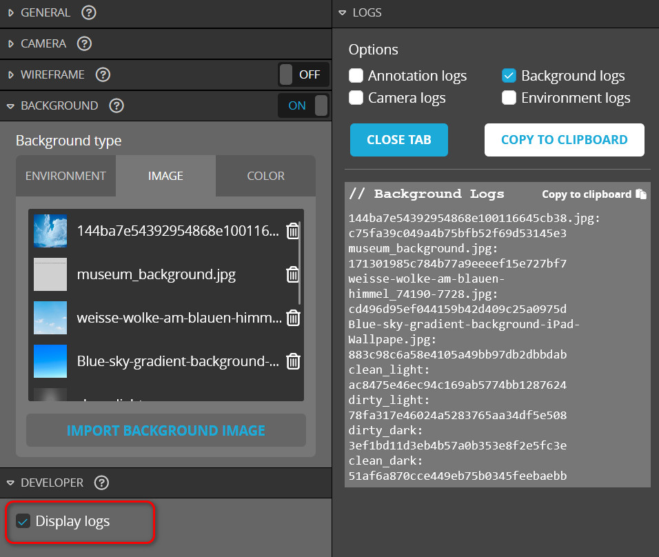
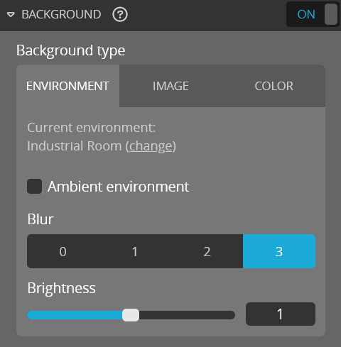

<script setup>
import CodePenEmbed from '../../components/CodePenEmbed.vue'
</script>

# Background

You can adjust the background of the viewer with the API, just like you can do with the editor. There are four flavors: environment, image, color and transparent. The environment is an image that is projected on a sphere around the scene. The image is a flat image that is projected on a plane behind the scene. The color is a solid color. Transparent is, well, transparent.

## Color

Setting the background color looks like this:

```js
api.setBackground({ color: [0, 0, 0] }, function () {
  window.console.log("Background changed");
});
```

The color is normalized in the 0-1 range. Take a look [here](../materials/colors.md) for more details about dealing with colors in Sketchfab.

<CodePenEmbed id="yLGOjQm/ca7979138ecf95a6b8fbb9a452c57517" tab="result" />

## Image

Setting the background image looks like this:

```js
api.setBackground({ uid: "51af6a870cce449eb75b0345feebaebb" }, function () {
  window.console.log("Background changed");
});
```

This background image is identified by a uid `51af6a870cce449eb75b0345feebaebb`, other images will have a different uid. You can find the uids of all the available backgrounds in the developer log of the sketchfab editor. If you have uploaded your own backgrounds, you'll find them there too. You can only use images that you have previously uploaded in the editor. You can't add background images with the API.



<CodePenEmbed id="poqyKoo/20ff7abd2aac444aed633731e44ab614" tab="result" />

In this example you can toggle between two backgrounds and a color. If you set both a color and an image, the image will be used and the color is ignored.

## Environment

The Sketchfab documentation does not give a lot of information on how to use the environment as a background. There's only the option to turn it on or off, but not to control the blur and brightness.

```js
api.setBackground({ enable: "environment" }, function () {
  window.console.log("Background changed");
});
```



_We can only turn the environment on, but some of the other settings are unavailable to the API_

The Blur of the environment background can be controlled by adjusting the environment settings, not the background settings. It seems we only have the blur levels, but not the "Ambient environment" which is super blurry. The Brightness of the background is tied to the exposure of the environment. Read more about this in the [environment](/guide/studio/environment#changing-environment-settings) tutorial.

<CodePenEmbed id="VwqagPx/5e3de4b40293988c9a6f6fe9840355d2" tab="result" />

This example shows you how to switch between a color and the environment.

## Transparent

All the backgrounds we've seen so far are opaque. That means that the backgrounds are part of the Sketchfab scene. You can also set the background to transparent. This is useful if you want to overlay the viewer on top of other content outside of Sketchfab.

```js
api.setBackground({ transparent: true }, function () {
  window.console.log("Background changed");
});
```

You also need to set the `client.init` option of `transparent: 1` to make this work. Read more about initialization options [here](../model-loading/initialization-options.md). That option is available for Pro users and up.

<CodePenEmbed id="BavzBOX/d2121f7d63eaccee5d3bc235f2bfa643" tab="result" />

I'm probably overdoing it with this example. The gradient and zigzag pattern are not part of the viewer, but are part of the page. The viewer is transparent and the background of the page is visible.

::: info Documentation
Background [documentation](https://help.sketchfab.com/hc/en-us/articles/203064198-Scene#background)
Background API [documentation](https://sketchfab.com/developers/viewer/functions#api-background)
:::
