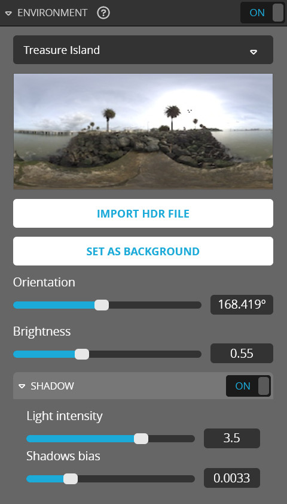

<script setup>
import CodePenEmbed from '../../components/CodePenEmbed.vue'
</script>

# Environment

The environment adds light and reflections to your scene. Optionally it can add shadows. The API enables you to change the environment and most of its settings. 



## Getting the environment

You can get the environment settings with the `getEnvironment` method. It returns an object with the current settings. 

```js
api.getEnvironment(function(err, envInfo) {
  window.console.log('Current environment:', envInfo);
});
```

<CodePenEmbed id="xxmRrva/435e6227fe040d22850aae40a6bf28e8" tab="result" />

As with the lights, the `Shadows bias` property is not available in the API.

You can't get the uid of the environment with the API. Similar to the backgrounds, you can only find out what the uid of the environment is by using the developer logs in the Sketchfab editor. Check the [backgrounds](/guide/studio/background#image) tutorial for more info. This is the list with the environments that ship with Sketchfab in my account. If you've uploaded a custom environment, it will show up here.

```
Studio Soft: 08468d6fcf9846039cc3e51accddd9f9
royal_esplanade_4k_desaturated: d106177604ef44cf8cdc539e4d942423
Trinitatis Church: e00dc642058b4176a4aaa449ea8ad5f8
Treasure Island: 5e7120378b00431ea18151e97a8366ec
Muir Wood: 41192cc664484a0fa565da3361d10c9c
Kirby Cove: 8653449395004fd58820874bfff93ce7
Gareoult: e871dd2920334a0f9c3107a00da3c24a
Bus Garage: 80fba9759ab94307a782f38d359b8ea8
Urban Exploring Interior: c281dff366844cbc8b33179337037f42
Terrace Near the Granaries: 16cdcddf277d423d99094f8db0c731e9
Glazed Patio by Restaurant: 2fa15e0b1cee45a5b02605a288934e1b
Gdansk Shipyard Buildings: 3e2ad3e1f1ea47679f045a7eb0e6af49
Cave Entry in the Forest: 268447ca0a954f44b06d1387863d114e
Abandoned Sanatorium: 2e9c3708feb74137b0436f946b8b66b8
St. Nicholas Church: 675ff0f13b474c62947097939fe9aa1e
Road in Tenerife Mountain: 749a0594343e4ff9a2875cb411d0ad1a
Road in Dordogne: 4eda3e78ed214dc8852c439dc64b9c9d
Protestant Church: df5b82c5ccec42cbb9c5ba9528f0be52
Industrial Room: 9190e8da70694ef3b9d1d0c01541917e
In Front of Chapel: 78a54c2fd53a4ba4891a4bbdac7f30f7
Studio: df380da788ee444885722735039b0c09
Queen Mary Chimney: cd5e5b1607d844cdb928e96ff9c36b5c
Popcorn Lobby: 491ddabd93aa49ecb5ad36538f7d00e3
Milky Way: 102d22e28ca34190a8470402ccdc35d3
Winter Forest: 4024128cf8904b69946e891caac5f305
Tropical Ruins: 5335c7c5c2434866ac8a442157f24f5e
Tropical Beach: b83e3a8794ae47e0b4039e7fdb031602
Topanga Forest: 591b2c2db5744df1803a09d477f5a2c7
Tokyo Big Sight: 2a016b232e444ef3a6ba323c51aa5063
Malibu Overlook: 02751cd893a14f3986fb17a90245f64f
Footprint Court: d348dfd2a8104ab0b8528f885d645eb3
Ditch River: 956bb00775a044e7afdd1c17f6bdab63
Bryant Park: e73867d210de4bc2b5eb261738cf3e79
Pine Tree Arch: e2aa1ab3582c4feab7371baf1e4cd734
Studio 2: efd4ef0fc18a4ec0a1313d782fade965
```

## Changing environment settings

You can change the environment with the `setEnvironment` method. It takes an object with settings, including the uid of the environment. You don't have to provide all settings, only the ones you want to change. 

```js
api.setEnvironment({
  uid: '3a68a92a99d849b19829e315b93e6d55',
  exposure: 0.2,
  lightIntensity: 1.0,
  rotation: 0.75,
  blur: 0.1,
  shadowEnabled: true
}, function() {
  window.console.log('Environment changed');
});
```

<CodePenEmbed id="QWzGMwd/582f810ff6a4f6f908f2328722de1238" tab="result" />

This example shows how you can manipulate the settings of the existing environment. Take care when dealing with rotations. The value is in radians, not degrees. Rotating the environment by 90 degrees would be `Math.PI / 2`.

Please note the `blur` setting that sets the blur of the background and doesn't affect the environment. This is a bit confusing.

## Changing the environment map

You can use the `setEnvironment` method to swap out the environment map. Use the `uid` property.

```js
api.setEnvironment({ uid: 'e73867d210de4bc2b5eb261738cf3e79' });
```

<CodePenEmbed id="xxmgWxE/58d72b75ed177e4ab5b144d448b9b617" tab="result" />

In this example, you'll notice something weird. The top button applies an environment with low exposure. The lighting should be very dark, but when you press the button, it's quite bright. Only until you press the button a second time, the dark lighting is applied. This is very probably due to default settings that ship with every environment map. You can see this effect in the Sketchfab editor as well. When you switch between environment maps, the lighting values change too even though you didn't touch them.

To avoid this, we need to call `setEnvironment` twice. Once to change the environment map and once to apply our own settings instead of the default ones. We'll use the callback of `setEnvironment` to make sure the second call is only executed after the first one is done.

```js
api.setEnvironment({ uid: uid }, function () {
  api.setEnvironment(settings);
});
```

The first API call only applies the uid of the environment map. The second call applies the settings. This way, we can make sure the settings are applied after the environment map is loaded and we override the defaults.

<CodePenEmbed id="GRPrxNB/6110888b69ae520e2ad33e07fbdfb352" tab="result" />

This example uses the exact same ligthing settings as the previous example. But here we split the `setEnvironment` call in two. You'll see that here, one buttonpress suffices to get the environment we want. In the previous example it took two buttonpresses.