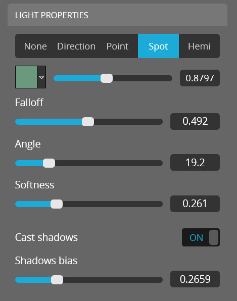
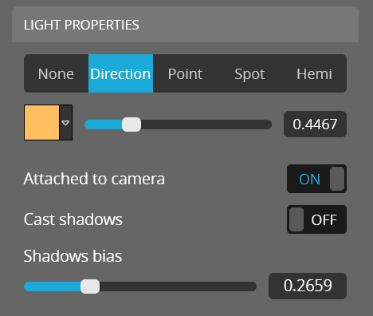
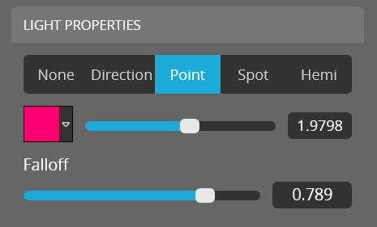

<script setup>
import CodePenEmbed from '../../components/CodePenEmbed.vue'
</script>

# Lights

Any scene can have up to three lights. The API enables you to manipulate these lights, such as turning them on and off, changing the color, enabling shadows and more. It's also possible to move and rotate lights, but we will cover that in later tutorials. It requires matrix math that is beyond the scope of this tutorial.

## Getting lights

The first step is to get the lights from the viewer. This is done with the `getLight` method. It returns the settings of a single light. We can also use the `isLightFeatureEnabled` to find out if the lights feature is enabled in the scene.

The `getLight` method takes an id as the first argument. There's one id for each light in the scene: 0, 1 or 2. 

```js
api.getLight(0, function(err, state) {
    window.console.log(state);
});
```

<CodePenEmbed id="XWoKBqY/3085e42855a2d9bbb54fdcd4e971d81b" tab="result" />

This example scene contains three different lights. One thing that stands out when you get the properties of each of these ligths, is that they all return the same number of properties. This list of properties does not match the properties that are available in the editor. You get some extra properties for certain lights and other properties are not available in the API. We have to make do :raised_eyebrow:

### Spot light

This is the data of the spotlight. I've removed the matrix data for now.

```js
{
  "type": "SPOT",
  "attached": true,
  "matrix": {...},
  "enabled": true,
  "shadowEnabled": true,
  "color": {
    "0": 0.42,
    "1": 0.6,
    "2": 0.49
  },
  "intensity": 0.87,
  "angle": 19.2,
  "falloff": 0.00007782915127005909
}
```

And these are the settings from the editor:



### Directional light

This is the data of the directional light. I've removed the matrix data for now.

```js
{
  "type": "DIRECTION",
  "attached": true,
  "matrix": {...},
  "enabled": true,
  "shadowEnabled": false,
  "color": {
    "0": 1,
    "1": 0.74,
    "2": 0.36
  },
  "intensity": 0.44,
  "angle": 45,
  "falloff": 0.00008901450994447913
}
```

And these are the settings from the editor:



### Point light

Finally, the data of the point light

```js
{
  "type": "POINT",
  "attached": false,
  "matrix": {...},
  "enabled": true,
  "shadowEnabled": false,
  "color": {
    "0": 0.99,
    "1": 0,
    "2": 0.43
  },
  "intensity": 1.9,
  "angle": 45,
  "falloff": 0.003413014998977679
}
```

And the settings from the editor:



## Setting lights

Let's try to manipulate the lights. We can use the `setLight` method to change the properties of a light. It takes three arguments: the id of the light, the properties to change and a callback function.

```js
api.setLight(2, {color: [1, 0, 0]}, function(err) {
  window.console.log('Set light');
});
```

### Spot light

This example sets the color of light `1` to red. The color is normalized in the 0-1 range. Take a look [here](../materials/colors.md) for more details about dealing with colors in Sketchfab.

The next example shows how to manipulate some of the settings of the spotlight. Please note that the falloff value is ridiculously tiny, but it does work. The `softness` property is not available in the API, nor is the `Shadows bias` property.

<CodePenEmbed id="NWerBMd/0d46a36e05cc77f4aee5f96a5005d47d" tab="result" />

### Directional light

This example sets the `shadowEnabled` and `attached` of light `0`. You'll notice that setting the `attached` does not work even though it's available in the API. The `shadowEnabled` property does work.

<CodePenEmbed id="GRPqwNV/4df48cea2699e94df0674557bce0fb9c" tab="result" />

### Point light

This final example adjusts the `color`, `falloff` and `type` of the light. The three types that I'm using here are `POINT`, `SPOT` and `DIRECTION`.

<CodePenEmbed id="oNJLQWJ/e5143268fa0f2fe77b087ce74994a730" tab="result" />

## Toggle all lights

Each individual light has an `enabled` property. You can toggle all lights at once with the `setLightFeatureEnabled` method. 

```js
api.setLightFeatureEnabled(true, function(err) {
  window.console.log("Lights ready to be used");
});
```

<CodePenEmbed id="BavzGqL/da7ec4e0483f16f536247019801f46ad" tab="result" />

::: info Documentation
Lighting API [documentation](https://sketchfab.com/developers/viewer/functions#api-section-lights)
:::