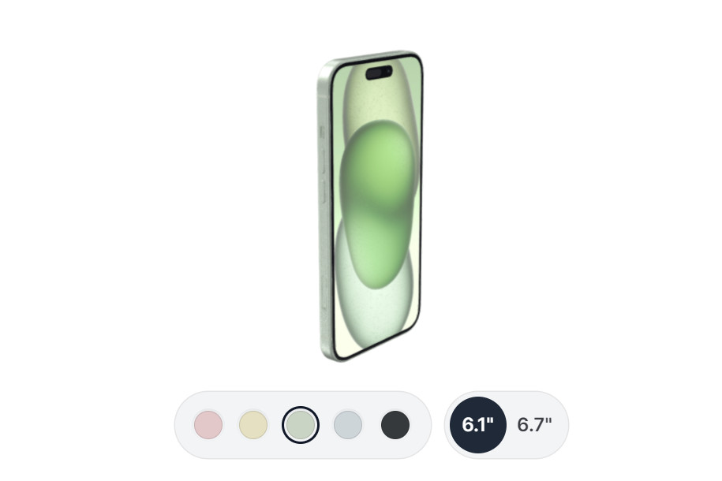

# Projects

Projects demonstrate different uses of the Sketchafb API. They are either demos or prototypes, or real-world projects. These projects combine multiple aspects of the API. Here I will explain what's happening and how to reproduce the results yourself.

Before trying out these projects yourself, I highly recommend you go through the [Getting started](../guide/model-loading/getting-started.html) tutorial. It will give you a good understanding of the basics of the API.

## Product showcase

Learn how to create a product showcase for a phone. It shows how to switch between different sizes and colors. It also shows how to move the model around and how to strictly control the camera movement.

[Get started...](./phone.html)

## Virtual showroom

Coming soon...
