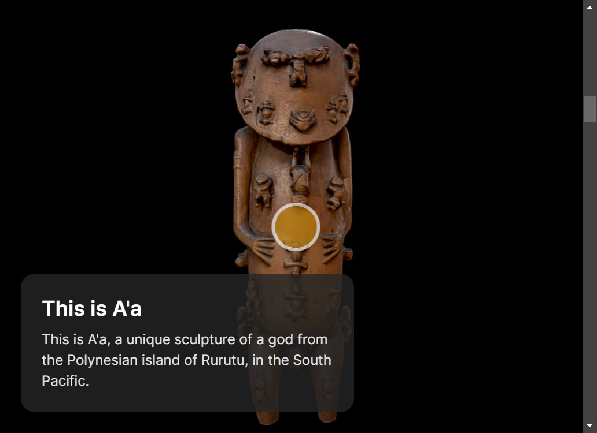
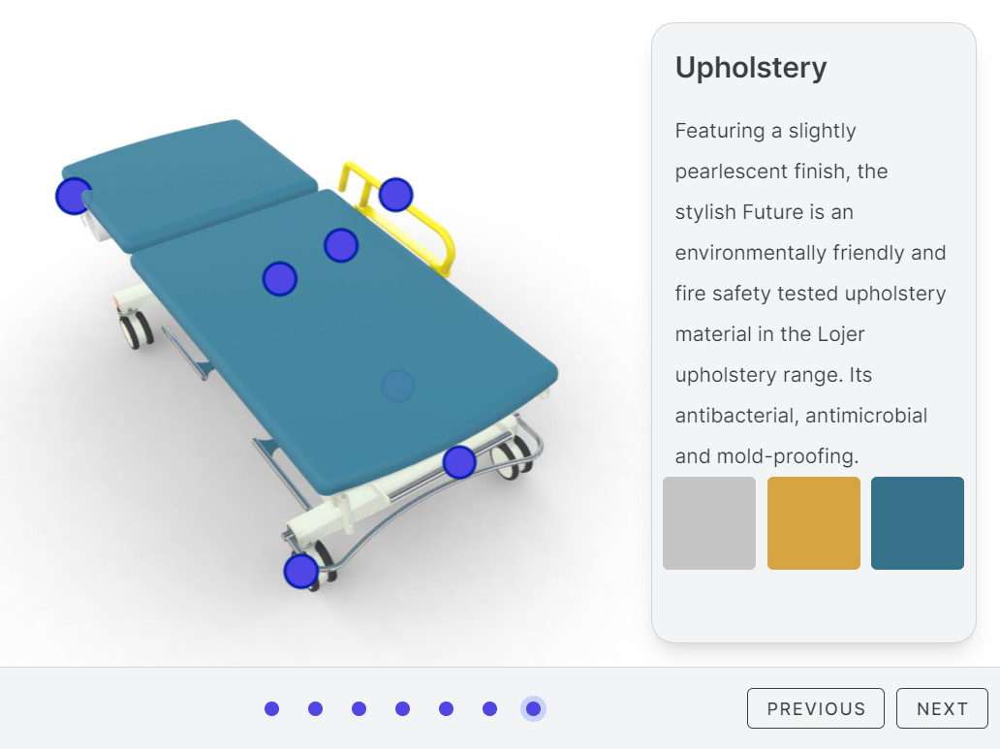
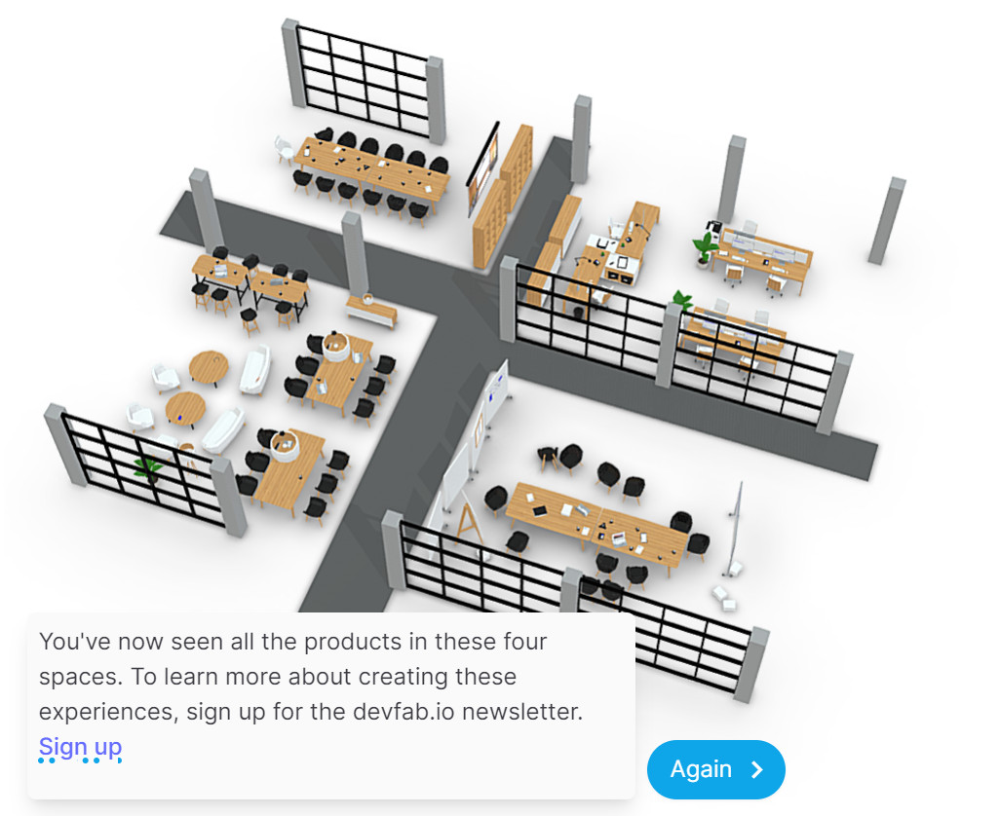

# Projects

Projects demonstrate different uses of the Sketchafb API. They are either demos or prototypes, or real-world projects. These projects combine multiple aspects of the API. Here I will explain what's happening and how to reproduce the results yourself.

Before trying out these projects yourself, I highly recommend you go through the [Getting started](../guide/model-loading/getting-started.html) tutorial. It will give you a good understanding of the basics of the API.

## Scrolling navigation

Using scrolling to navigate a 3D model is practical when you have a linear story to tell. Scrolling works like scrubbing the timeline of a video. the user can control the speed at which things are moving, but you control the order in which things are shown. Art and cultural heritage are great use cases for this kind of navigation.

[Get started...](./scrolling.html)

## Product showcase

Learn how to create a product showcase for a phone. It shows how to switch between different sizes and colors. It also shows how to move the model around and how to strictly control the camera movement.

[Get started...](./phone.html)

## Product Tour

Learn how to create a product tour. You can enhance the experience with texts, images and even configuration options. A great way to show off a product or a piece of art.

[Get started...](./product-tour.html)

## Showroom experience

A showroom experience is a 3D virtual space that can act as a showroom for products, a museum for art or a virtual event space for instance. Instead of showing one model at a time, you can show multiple models in a single scene.

[Get started...](./showroom-experience.html)
