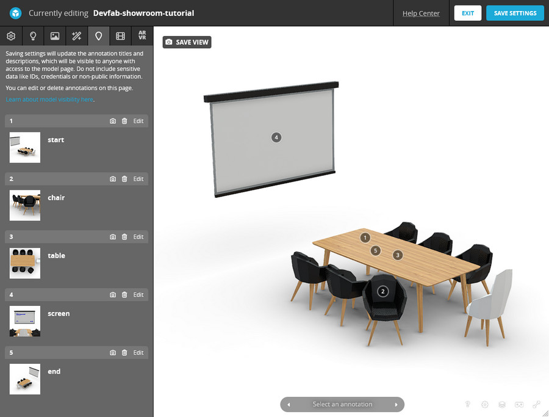

<script setup>
import ShowroomExperience from '../components/ShowroomExperience.vue'
import CodePenEmbed from '../components/CodePenEmbed.vue'
</script>

# Showroom Experience

<ShowroomExperience />

A showroom experience is a 3D virtual space that can act as a showroom for products, a museum for art or a virtual event space for instance. Instead of showing one model at a time, you can show multiple models in a single scene.

This tutorial will show you how to navigate such a scene, show images and text and even add images to the 3D model itself. If this is your first time working with the Sketchfab API, I recommend you start with the [Getting started](../guide/model-loading/getting-started.html) tutorial.

## Features

The showroom experience has the following features:

- A 3D scene of a conference room with multiple objects
- Stepped navigation with annotations
- Controlled camera movement
- Info panel with text and images

The 3D model contains annotations, but all the contents is contained in the web-app.

## The model

<CodePenEmbed id="gOqLEdL/b86ec92afe5da75799ed07799f923013" tab="result" />

The navigation is based on annotations, but we don't want to show any of them. We'll use a custom button to navigate to the next annotation.

We'll use these init settings:

```js
autostart: 1,
annotations_visible: 0,
scrollwheel: 0,
ui_controls: 0,
ui_infos: 0,
ui_watermark: 0,
ui_stop: 0,
camera: 0,
```

- `annotations_visible: 0` hides the annotations
- `ui_controls: 0` hides all default controls
- `scrollwheel: 0` disables zooming with the scrollwheel. This helps to prevent the user from zooming in or out too far.

In my experience I like to keep very strict camera control. You can opt to give users a bit more freedom, fur instance by allowing them to zoom.

Take a look at the [Menu and embedding](../guide/annotations/menu) tutorial for further explanation of settings.

## Step by step

<CodePenEmbed id="MWLbxxP/81954e355dedbb9e33dc00220002ede6" tab="result" />

I have three steps in this showroom experience. Each step has a title. By using the "next" button, the user can navigate to the next step. We've already seen this behavior in the [Product tour](../product-tour) project. The difference is that in this project, we're letting the app drive the navigation instead of the Sketchfab model.

What this means is, that the model can have any number of annotations in it, but we only use the ones that we specify in the app. This gives us flexibility in how we're using the model. Our model has four annotations.



In the next code snippet, you see the list of steps that we want to display. Once the model has loaded and the `viewerready` event has fired, we run the `parseAnnotations` method. It loops over all available annotations, and stores the ones that we need in the `annotations` array.

```js
let annotations = [];

const steps = [
  {
    name: "Meeting Table",
    annotationname: "table",
  },
  {
    name: "Projection Screen",
    annotationname: "screen",
  },
  {
    name: "Desk Chair",
    annotationname: "chair",
  },
];

const parseAnnotations = (api) => {
  api.getAnnotationList((error, annotationlist) => {
    annotations = steps.map((step) =>
      annotationlist.find(
        (annotation) => annotation.name === step.annotationname,
      ),
    );
  });
};
```

The following code snippet shows you what happens when the user presses "Next". The `setStep` method is called. It creates an ID for the next annotation and calls the `gotoAnnotation` method. That method uses the `setCameraLookAt` method to move the camera to the next annotation. Once the camera has reached its destination, we set the camera constraints again. You can see why we're doing this and how exactly in the [Annotations and constraints](../guide/annotations/annotation-constraints) tutorial. In short: we're not using the annotations to navigate, but we're using them to set the camera positions directly.

```js
const setStep = () => {
  currentId = currentId === steps.length - 1 ? 0 : currentId + 1;
  const annotation = annotations[currentId];
  gotoAnnotation(api, annotation);
};

const gotoAnnotation = (api, annotation) => {
  const settings = {
    usePanConstraints: true,
    target: annotation.target,
  };
  api.setEnableCameraConstraints(false, {}, () => {
    api.setCameraLookAt(annotation.eye, annotation.target, 2, (err, id) => {
      api.setCameraLookAtEndAnimationCallback(() => {
        api.setCameraConstraints(settings, () => {
          api.setEnableCameraConstraints(true, {});
        });
      });
    });
  });
};
```

## Bookends

I want to start and end the experience with their own steps. I'm calling these bookends. The first step is a title screen. The last step is a thank you screen. It makes the whole experience a bit more polished.

We're enhancing the `setStep` method to handle the bookends. We're using a `stepType` variable to keep track of the current step. We're also using a `bookendAnnotation` variable to store the annotation for the bookend. The idea is that we first start, then go through our three steps and then end. Once you arrive at the end, you can restart the experience.

```js
let stepType = "start";

const setStep = () => {
  if (stepType === "start") {
    currentId = 0;
    stepType = "step";
  } else if (stepType === "end") {
    stepType = "start";
  } else if (currentId === steps.length - 1) stepType = "end";
  else currentId = currentId === steps.length - 1 ? 0 : currentId + 1;

  const annotation =
    stepType === "step" ? annotations[currentId] : bookendAnnotation;
  gotoAnnotation(api, annotation);
  showStepContent(steps[currentId]);
};
```

To show the currect buttontext and title, we need to apply some logic. Depending on the `stepType` and the `currentId`, we need to show different text. We're using the `getContent` method to return the correct text and title. We're using the `showStepContent` method to update the DOM.

```js
const getContent = () => {
  let buttontext = "";
  let title = "";

  if (stepType === "start") {
    buttontext = "Start";
    title = startStep.name;
  } else if (stepType === "end") {
    buttontext = "Again";
    title = endStep.name;
  } else if (currentId === steps.length - 1) {
    buttontext = "Finish";
    title = steps[currentId].name;
  } else {
    buttontext = "Next";
    title = steps[currentId].name;
  }
  return { buttontext, title };
};

const showStepContent = (step) => {
  const { buttontext, title } = getContent();
  elButton.innerHTML = buttontext;
  elTitle.innerHTML = title;
};
```

## Add more content

Besides the title and the button, I also want to show a thumbnail image and some text. We need to add that content to your data objects and array and enhance the `getContent` and `showStepContent` methods.
